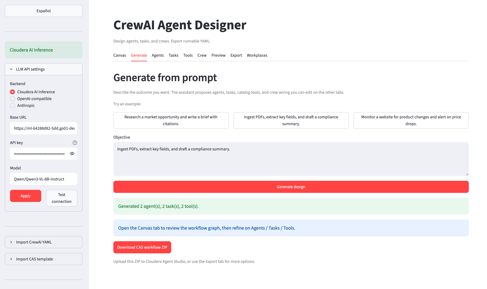
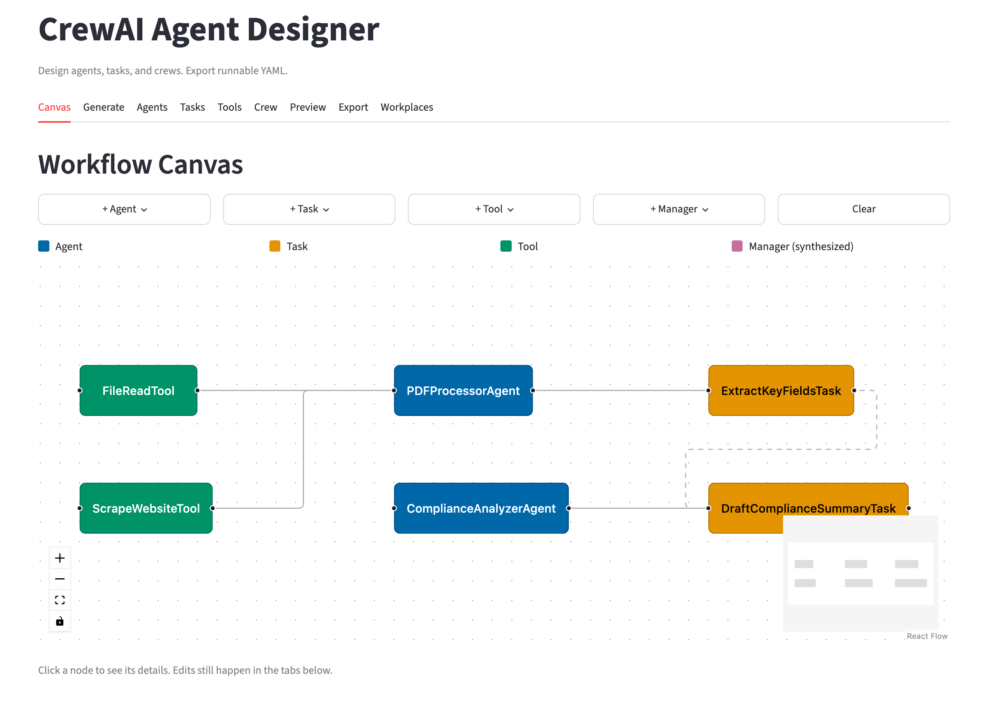
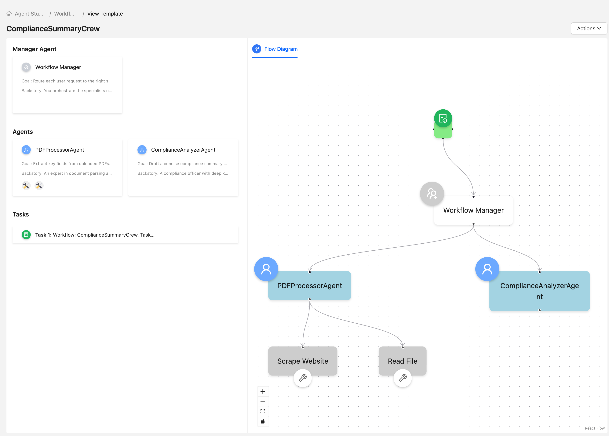

# Cloudera Blueprint: CrewAI Agent Designer

> A Cloudera AI application that provides a visual designer for [CrewAI](https://docs.crewai.com/) multi-agent systems and exports production-ready `agents.yaml`, `tasks.yaml`, and `crew.py` files. Catalog and website fields live in [`METADATA.yaml`](METADATA.yaml).

## Table of Contents

- [Overview](#overview)
- [Demo](#demo)
- [Use Case](#use-case)
- [Key Features](#key-features)
- [Quickstart](#quickstart--guide)
- [Architecture / Software Components](#architecture--software-components)
- [Target Audience](#target-audience)
- [Repository Structure](#repository-structure)
- [Prerequisites](#prerequisites)
- [Hardware Requirements](#hardware-requirements)
- [Documentation](#documentation)

## Overview

[comment]: <> (Why: First impression for catalog visitors and GitHub readers. Answer "what is this and why Cloudera?" in one scannable paragraph. Audience: executives, architects, and developers browsing the catalog.)

The CrewAI Agent Designer is a Cloudera AI application (Launchable AMP) for building multi-agent systems visually. Users compose agents (role, goal, backstory, tools), define tasks and their agent assignments, wire up a crew with a chosen execution process, and export the exact YAML and Python files CrewAI consumes — no hand-editing required. The designer runs entirely on Cloudera AI and uses Cloudera AI Inference Service by default for AI-assisted drafting of agent personas and task descriptions, with pluggable support for external LLM providers (OpenAI, Anthropic, and any OpenAI-compatible endpoint) for portability.

## Demo

[comment]: <> (Why: Proof that the blueprint works end-to-end. A Reprise or recorded walkthrough lowers adoption friction for SEs and customers who won't clone the repo first. Audience: sales, SEs, and evaluators.)

Reprise walkthrough: [https://[catalog-url]/crewai-agent-designer](https://[catalog-url]/crewai-agent-designer) *(link populated on publish)*

### UI screenshots

**Generate from a prompt** — describe the crew objective; the designer proposes agents, tasks, and wiring.

**Generated canvas** — visual crew graph after generation, ready to edit.

**Cloudera Agent Studio** — the same design imported as a CAS workflow.

## Use Case

[comment]: <> (Why: Connects technical components to a business problem. Helps catalog filters and internal reviewers assess industry fit and alignment. Audience: solution architects and customer stakeholders validating relevance.)

Teams adopting CrewAI hand-author `agents.yaml` and `tasks.yaml` files where phrasing (role, goal, backstory) directly affects agent behavior, and where task-to-agent wiring and tool bindings are easy to get wrong. This slows time-to-first-crew, produces inconsistent results across teams, and makes review painful. The designer replaces the blank-YAML-file starting point with a guided visual editor that validates against the CrewAI schema, uses an LLM on Cloudera AI Inference to draft persona text from short prompts, and exports the finished configuration in one click — cutting the loop from an idea to a runnable crew from hours to minutes.

## Key Features

[comment]: <> (Why: Scannable differentiators for the catalog detail page and README skimmers. Keep these outcome-oriented, not implementation details. Audience: architects comparing blueprints and developers scanning for capabilities.)

- **Visual agent, task, and crew editor** — compose each element in a form, with live validation against the CrewAI schema.
- **AI-assisted persona drafting** — describe an agent in one line; the designer proposes `role`, `goal`, and `backstory` you can accept or edit.
- **Tool binding UI** — attach CrewAI tools (SerperDev, Wikipedia, custom, etc.) to agents without touching Python.
- **One-click YAML export** — download a zip containing `agents.yaml`, `tasks.yaml`, and `crew.py` ready to drop into a CrewAI project.
- **Cloudera AI Inference by default** — the AI-assist backend uses your existing Cloudera AI Inference endpoint out of the box; external providers (OpenAI, Anthropic, OpenAI-compatible) supported for portability.
- **Schema-first validation** — every export is checked against CrewAI's expected field types before download, so crews run on first launch.
- **One-click export to Cloudera Agent Studio** — the same design ships as a full CAS workflow bundle (agents, tools, and a synthesized manager wired together in `workflow_template.json`), ready to import into CAS in a single upload.

## Quickstart / Guide

[comment]: <> (Why: The minimum path from clone to working demo. Reduces time-to-first-success for developers and SEs running the blueprint in a lab. Link out to Reprise or docs if setup is long. Audience: hands-on implementers.)

1. Clone the repository into a Cloudera AI workspace, or deploy directly as an AMP from the Cloudera AI catalog (see [`docs/cml-deploy.md`](docs/cml-deploy.md)).
2. Configure the LLM backend: set `CDP_INFERENCE_ENDPOINT` for Cloudera AI Inference, or `OPENAI_API_KEY` / `ANTHROPIC_API_KEY` for external providers. See [`docs/env-vars.md`](docs/env-vars.md). LLM config is optional — the visual editor works without it.
3. Start the Cloudera AI application from the workspace UI (the AMP registers the entry point automatically), or locally: `streamlit run app/streamlit_app.py`.
4. Open the **Generate** tab, describe your crew's objective, and let the assistant propose agents, tasks, and tools — or start from scratch on the Canvas / Agents tabs.
5. Edit agents, tasks, tool bindings, and the crew's execution process. Preview YAML as you go.
6. Click **Export** to download a CrewAI project ZIP (`agents.yaml`, `tasks.yaml`, `crew.py`) or a Cloudera Agent Studio workflow ZIP. From Generate you can also download the CAS ZIP right after a successful run.

## Architecture / Software Components

[comment]: <> (Why: Shows how Cloudera products and supporting services fit together. Helps platform teams validate dependencies and security review scope. Audience: architects, platform engineers, and technical reviewers.)

- **Cloudera AI application runtime** — hosts the designer as a long-running web app in the customer's workspace.
- **Streamlit UI** — the visual designer front end.
- **CrewAI SDK** — used server-side for schema validation and YAML generation, ensuring exports match the version-pinned CrewAI contract.
- **Cloudera AI Inference Service** *(default)* — serves the LLM that powers persona and task drafting. Any Cloudera-served model works.
- **External LLM providers** *(optional)* — OpenAI, Anthropic, or any OpenAI-compatible endpoint via env-var configuration.

Architecture diagram: see [`assets/cover.png`](assets/cover.png).

## Target Audience

[comment]: <> (Why: Sets expectations for skill level and role so readers self-select before investing in deployment. Also guides catalog positioning and demo narrative. Audience: blueprint authors and catalog curators; indirectly helps readers.)

- **ML engineers** building multi-agent systems on Cloudera and shipping CrewAI configs to production.
- **Sales engineers and solution architects** demoing agentic AI on Cloudera without pre-writing YAML by hand.
- **AI application developers** prototyping crews before committing to a full CrewAI project scaffold.

## Repository Structure

[comment]: <> (Why: Orients new contributors and forked repos to where code, deploy configs, and metadata live. Keeps blueprint repos consistent across the catalog. Audience: developers extending the blueprint and reviewers auditing repo completeness.)

| Path | Description |
| --- | --- |
| `app/` | Streamlit application source |
| `0_session-install-dependencies/` | AMP session script to install Python deps |
| `1_app-crewai-designer/` | AMP application launch script (Streamlit) |
| `.project-metadata.yaml` | AMP install runbook (required at repo root) |
| `catalog-entry.yaml` | Custom / community AMP catalog entry |
| `requirements.txt` | Runtime Python dependencies |
| `requirements-dev.txt` | Dev/test dependencies (`pytest`) |
| `assets/` | Catalog cover (`cover.png`) |
| `images/` | UI screenshots for the README |
| `docs/` | Env vars, CML deploy guide, workplaces, YAML notes |
| `examples/` | Sample crews exported by the designer |
| `tests/` | Pytest suite |
| `METADATA.yaml` | Catalog metadata for the Cloudera blueprint website |
| `README.md` | This file |

## Prerequisites

[comment]: <> (Why: Surfaces blockers before someone starts deployment—entitlements, API keys, tooling. Reduces failed installs and support churn. Audience: developers and SEs preparing an environment.)

- **Cloudera AI workspace** with permission to launch applications.
- **Python 3.11+** (provided by the Cloudera AI runtime).
- **CrewAI SDK** (`crewai` — installed via `requirements.txt`).
- **LLM backend access**, one of:
  - A Cloudera AI Inference Service endpoint (default; recommended), **or**
  - An OpenAI API key, Anthropic API key, or any OpenAI-compatible endpoint URL + key.
  - Or none — the designer UI still runs; Assist / Generate stay disabled until configured.
- **Git** for cloning if not deploying via the AMP catalog.

## Hardware Requirements

[comment]: <> (Why: Sets realistic expectations for demo vs. production sizing. Helps SEs pick lab instances and customers plan capacity. Audience: platform engineers and infrastructure teams provisioning environments.)

| Deployment | Minimum |
| --- | --- |
| Launchable / demo | 2 vCPU, 8 GB RAM, 5 GB storage — no GPU (LLM inference is remote) |
| Production / enterprise | 4 vCPU, 16 GB RAM, 20 GB storage — GPU optional (only needed if co-locating a local model rather than calling Cloudera AI Inference) |

## Documentation

[comment]: <> (Why: Points to deeper material without bloating the README. Optional but valuable for complex blueprints. Audience: implementers who need runbooks, API refs, or video overviews beyond the quickstart.)

- [Deploy as a CML AMP](docs/cml-deploy.md) — catalog source, install tasks, smoke checklist.
- [Environment variables](docs/env-vars.md) — LLM backend precedence and reference.
- [Workplaces](docs/workplaces.md) — organizing designs by team/project.
- [CrewAI agents documentation](https://docs.crewai.com/v1.14.7/en/concepts/agents) — canonical reference for the agent fields the designer exports.
- [CrewAI tasks documentation](https://docs.crewai.com/v1.14.7/en/concepts/tasks) — canonical reference for task fields.
- [Cloudera AI documentation](https://docs.cloudera.com/machine-learning/) — workspace, application, and inference service setup.
- [CML Community AMP Template](https://github.com/cloudera/CML_Community_AMP_Template) — packaging conventions this repo follows.
- [AMP project specification](https://docs.cloudera.com/machine-learning/cloud/applied-ml-prototypes/topics/ml-amp-project-spec.html) — `.project-metadata.yaml` schema.
